# 玩儿转Ollama本地大模型
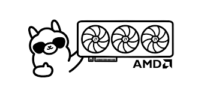


* 文档代码已经开源在GitHub: [ai_projects](https://github.com/yoyojacky/ai_projects).

## 准备开始


在开始前，请仔细看看硬件软件的需求，大部分的电脑均可以支持，甚至一些SBC也可以使用，只是性能上可能会比较差一些。也不是不能用。
例如：

* Raspberry Pi 4B 8GB内存版
* Raspberry Pi 5 8GB内存版
* Lattepanda 3 delta 8GB内存版 
* Lattepanda N100 8GB内存版 
* OrangePi 5 16GB 内存版
* Mac book pro 2013 16GB内存版
* Windows - 待测

###硬件需求
#### 最小硬件建议

* 建议CPU时钟最好2.4GHz以上
* 建议内存容量最好8GB以上
* 建议空闲磁盘空间大于40GB
* 建议检查CPU是否支持AVX指令集
* [可选] 如果有GPU支持会更好，显存越大越好，如果有条件，可以4090ti，或者A100. 

###软件需求
#### 操作系统
* Windows - 要求win10及以上
* Linux - 没要求 
* MacOS - 要求macOS 11 Big Sur及以上 

```bash
【建议】- Linux下运行更丝滑：建议使用Ubuntu24.04LTS 64bit版本
```

## 总览
总体的安装流程很简单，安装ollama框架，然后下载模型，运行模型，如果想要做应用，需要尝试调用api结合python的脚本实现更自动化的操作，例如批量处理弱智吧的问题并生成json文件等。 

## 安装Ollama框架

* 注意: windows和macos下需要下载软件包。

###Windows 

* [下载](https://ollama.com/download/OllamaSetup.exe)
下载后双击安装。

###MacOS

* [下载](https://ollama.com/download/Ollama-darwin.zip)
解压后参考macOS的安装方式安装，双击DWG文件并拖拽ollama 到application目录即可。

###Linux
这里以树莓派5的Raspberry Pi OS 64bit bookworm为例。
打开终端输入:
```bash
curl -fsSL https://ollama.com/install.sh | sh
```
然后等待安装完成。


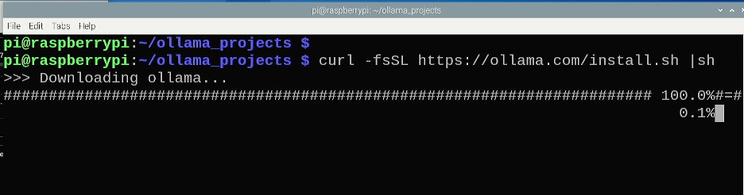
完成图片如图所示：
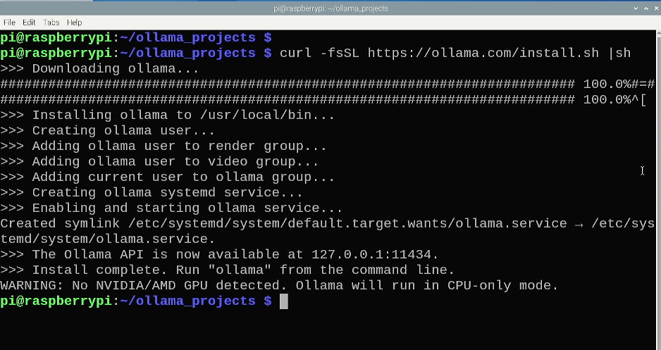

## 下载ollama 模型
模型的名称可以根据[Models](https://ollama.com/library) 获取。
下面简单以llama3模型为例：

### Window 


* Windows:打开一个CMD窗口，然后执行：

```bash
ollama pull llama3 
```

### macOS 
* macOS:打开一个iterm窗口，然后执行：

```bash
ollama pull llama3 
```

### Linux 
* 快捷键：ctrl+alt+T 打开一个终端，然后输入:

```bash
ollama pull llama3 
```
#### Linux下快速批量下载模型
终端执行：

```bash
for i in llama3 phi3 mistral qwen:7b;
do 
  ollama pull $i
  sleep 1
done 
```

效果如图所示：
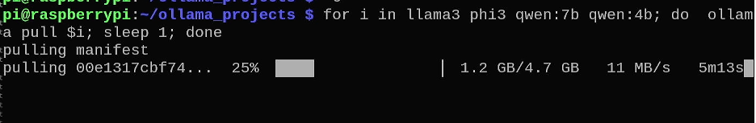
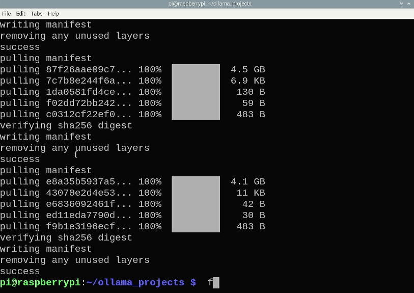

## 本地终端运行ollama

```bash
ollama run llama3 --verbose 
```
PS: 这里命令后面添加了--verbose，主要是可以在AI完成后可以看到平均token
的速度，可以通过后面的信息来判断性能是否够用。

如图：
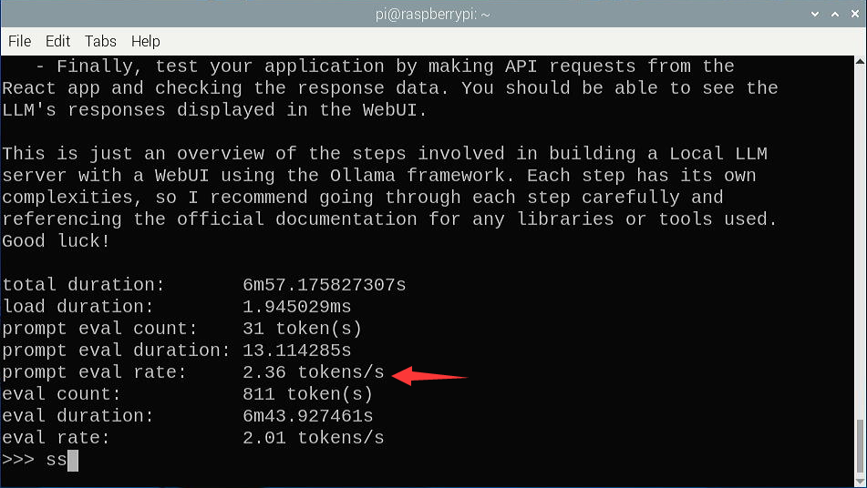
这里显示的是总共用时时间，加载用时，总共用了多少prompt的token，prompt的
速率等，总共用了多少token的信息，这些可以简单评估模型在当前机器上运行的性能。
这张图时我用树莓派5运行mistral模型生成一个问题的信息。
###安装视频
<video width="600" controls>
  <source src="./imgs/installation.mp4" type="video/mp4">
</video>

## ollama本地命令

* 下图是输入`/?`时显示的ollama框架的命令。

* 可用命令列表：

|命令| 描述|
|------|----|
|/set | 设置会话变量|
|/show| 显示模型信息|
|/load <model> | 加载一个会话或者模型|
|/save <model> | 保存当前的会话 |
|/clear | 清除会话的上下文| 
|/bye | 退出 |
|/?, /help | 命令的帮助文档|
|/? shortcuts | 键盘快捷键帮助 | 

* 举个例子：
例如我刚才提出的问题，模型回答的很好，满足我的需求，我想将这个对话保存到模型里面。
可以执行

```bash
/save mistral 
```
就保存到模型里面了,如图所示：

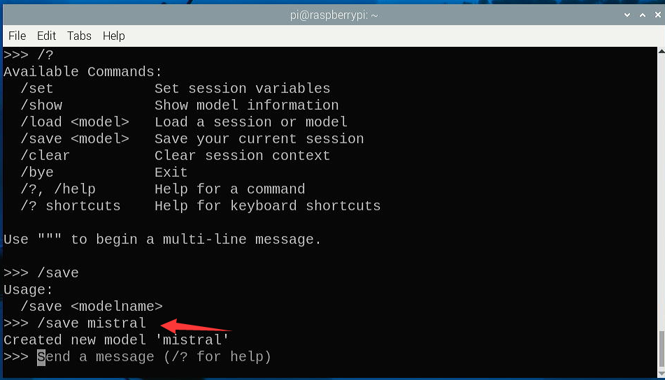

## 模型存储相关
* 模型动辄几个GB,所以我们需要知道模型存放系统的什么位置。
通过下面的路径可以看到模型的路径：

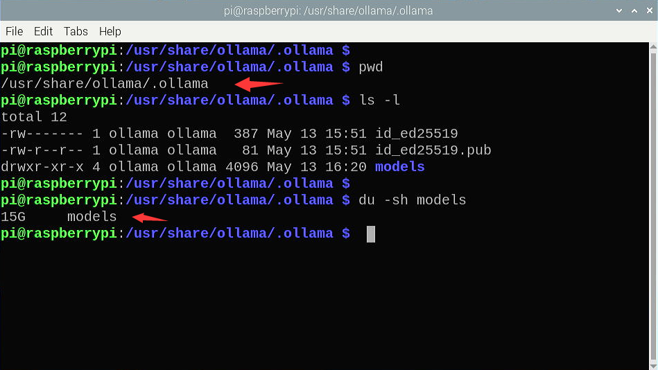

* 通过命令行检查系统中下载好的模型信息。

```bash
ollama list 
```
可以看到如下结果：
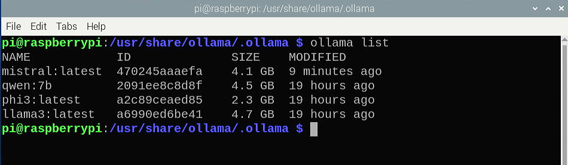

这里列出来的就是我之前通过shell脚本批量下载的模型。
### 模型备份
* 思路：
备份模型，就是将所有`/usr/share/ollama`的目录全部拷贝到移动硬盘或者其他
存储设备上。然后将更大的磁盘挂载到`/usr/share/ollama`目录，将数据拷贝回来。
备份方法很简单,例如挂载一个硬盘，然后执行下面的命令:

```bash
rsync -avz --progress /usr/share/ollama /YOUR_BACKUP_MOUNTING_POINT 
```
PS: 替换`YOUR_BACKUP_MOUNTING_POINT`为你的磁盘的挂载点。
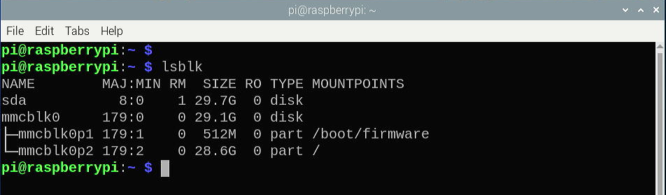
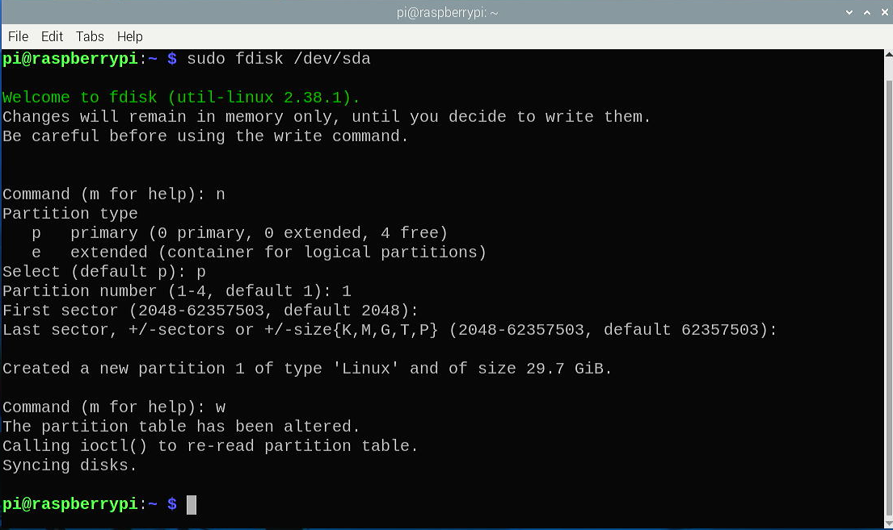
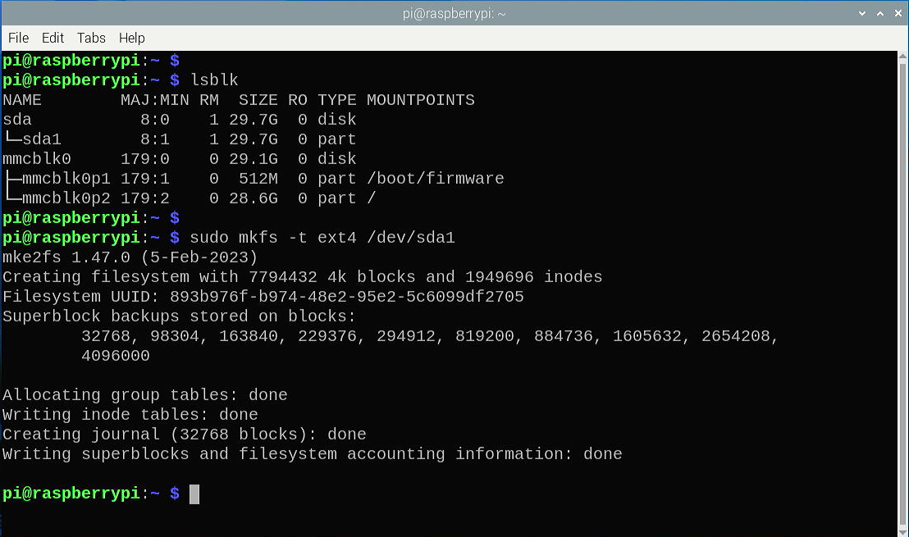
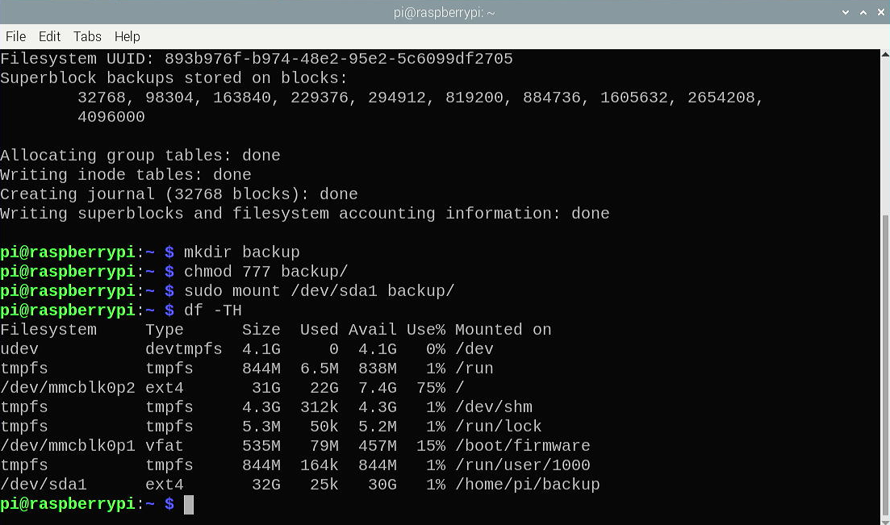
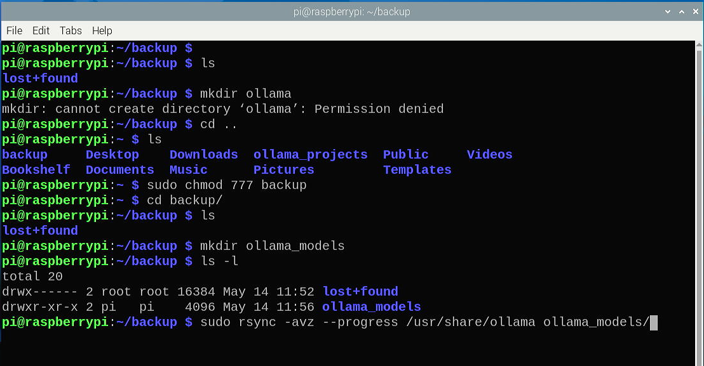
		
* 举例：
假设我有一个32Gb的全新移动硬盘,接入树莓派后迁移模型的全过程.
###检查磁盘

###磁盘分区

###格式化

###创建挂载点并挂载

###备份模型

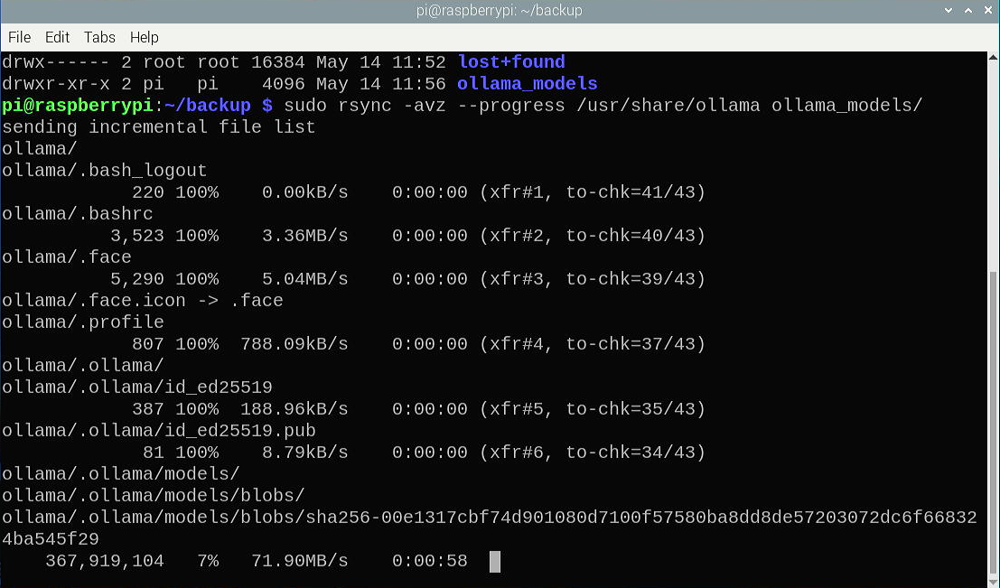

###命令解析
```bash
sudo fdisk /dev/sda
然后n -> p - > 1 -> Enter -> Enter -> w
就是新建主分区，编号1，使用全部磁盘，保存分区表。
sudo mkfs.ext4 /dev/sda1
sudo mkdir -pv /usr/local/ollama 
sudo mount -t ext4 /dev/sda1 /usr/local/ollama 
sudo vim /etc/fstab 
添加：
/dev/sda1  /usr/local/ollama  ext4  defaults  0 0 
保存退出。
sudo mount -a
检查：
df -Th 
如果看到/dev/sda1 挂载到了/usr/local/ollama 
```
## API调用
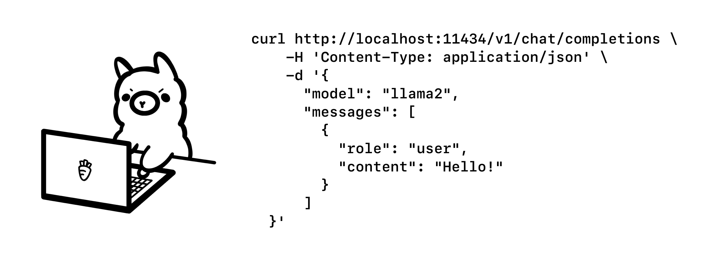
Ollama 现在内置了与 OpenAI Chat Completions API的兼容性，使得可以在本地通过 Ollama 使用更多工具和应用程序。
###用法
要调用 Ollama 的 OpenAI 兼容 API 端点，请使用相同的OpenAI 格式并将主机名更改为http://localhost:11434：
```bash
curl http://localhost:11434/v1/chat/completions \
    -H "Content-Type: application/json" \
    -d '{
        "model": "llama2",
        "messages": [
            {
                "role": "system",
                "content": "You are a helpful assistant."
            },
            {
                "role": "user",
                "content": "Hello!"
            }
        ]
    }'
```
### OpanAI Python库
示例：
```python
from openai import OpenAI

client = OpenAI(
    base_url = 'http://localhost:11434/v1',
    api_key='ollama', # required, but unused
)

response = client.chat.completions.create(
  model="llama2",
  messages=[
    {"role": "system", "content": "You are a helpful assistant."},
    {"role": "user", "content": "Who won the world series in 2020?"},
    {"role": "assistant", "content": "The LA Dodgers won in 2020."},
    {"role": "user", "content": "Where was it played?"}
  ]
)
print(response.choices[0].message.content)

```
### 集成Autogen库
Autogen是微软Microsfot的一个流行的开源框架，用于构建多代理应用程序。
我们可以尝试codellama模型

* 下载codellamam模型

```bash
ollama pull codellama
```

*安装autogen

```bash
pip install Autogen
```
然后创建一个Python脚本`example.py` 用来将ollama和autogen结合使用：

```python
from autogen import AssistantAgent, UserProxyAgent

config_list = [
  {
    "model": "codellama",
    "base_url": "http://localhost:11434/v1",
    "api_key": "ollama",
  }
]

assistant = AssistantAgent("assistant", llm_config={"config_list": config_list})

user_proxy = UserProxyAgent("user_proxy", code_execution_config={"work_dir": "coding", "use_docker": False})
user_proxy.initiate_chat(assistant, message="Plot a chart of NVDA and TESLA stock price change YTD.")
```

最后，运行示例代码，会让AI助手编写绘制图表的代码：

```bash
python example.py
```

## 集成webUI
待续...

## 安装Docker
待续...

## 拉取webUI镜像 
待续...

## Docker管理
待续...

## OLLAMA+Langchain+streamlit
* 搭建属于自己的RAG平台-待定
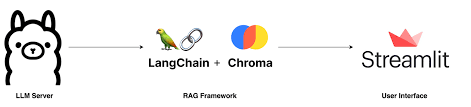

