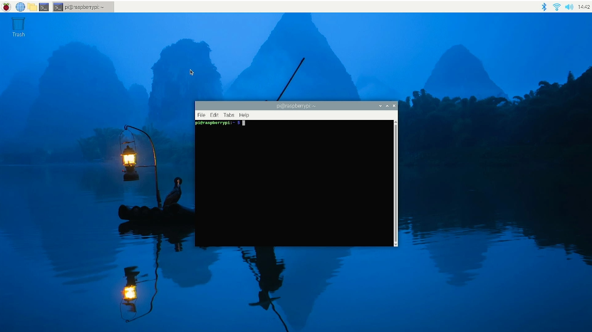

# 玩儿转Ollama本地大模型


* 文档代码已经开源在GitHub: [ai_projects](https://github.com/yoyojacky/ai_projects).

## 准备开始


在开始前，请仔细看看硬件软件的需求，大部分的电脑均可以支持，甚至一些SBC也可以使用，只是性能上可能会比较差一些。也不是不能用。
例如：

* Raspberry Pi 4B 8GB内存版
* Raspberry Pi 5 8GB内存版
* Lattepanda 3 delta 8GB内存版 
* Lattepanda N100 8GB内存版 
* OrangePi 5 16GB 内存版
* Mac book pro 2013 16GB内存版
* Windows - 待测

###硬件需求
#### 最小硬件建议

* 建议CPU时钟最好2.4GHz以上
* 建议内存容量最好8GB以上
* 建议空闲磁盘空间大于40GB
* 建议检查CPU是否支持AVX指令集
* [可选] 如果有GPU支持会更好，显存越大越好，如果有条件，可以4090ti，或者A100. 

###软件需求
#### 操作系统
* Windows - 要求win10及以上
* Linux - 没要求 
* MacOS - 要求macOS 11 Big Sur及以上 

```
【建议】- Linux下运行更丝滑：建议使用Ubuntu24.04LTS 64bit版本
```

## 总览
总体的安装流程很简单，安装ollama框架，然后下载模型，运行模型，如果想要做应用，需要尝试调用api结合python的脚本实现更自动化的操作，例如批量处理弱智吧的问题并生成json文件等。 

## 安装Ollama框架

* 注意: windows和macos下需要下载软件包。

###Windows 

* [下载](https://ollama.com/download/OllamaSetup.exe)
下载后双击安装。

###MacOS

* [下载](https://ollama.com/download/Ollama-darwin.zip)
解压后参考macOS的安装方式安装，双击DWG文件并拖拽ollama 到application目录即可。

###Linux
这里以树莓派5的Raspberry Pi OS 64bit bookworm为例。
打开终端输入:
```
curl -fsSL https://ollama.com/install.sh | sh
```
然后等待安装完成。



完成图片如图所示：


## 下载ollama 模型
模型的名称可以根据[Models](https://ollama.com/library) 获取。
下面简单以llama3模型为例：

### Window 


* Windows:打开一个CMD窗口，然后执行：

```
ollama pull llama3 
```

### macOS 
* macOS:打开一个iterm窗口，然后执行：

```
ollama pull llama3 
```

### Linux 
* 快捷键：ctrl+alt+T 打开一个终端，然后输入:

```
ollama pull llama3 
```
#### Linux下快速批量下载模型
终端执行：

```
for i in llama3 phi3 mistral qwen:7b;
do 
  ollama pull $i
  sleep 1
done 
```

效果如图所示：


## 本地终端运行ollama

```
ollama run llama3 --verbose 
```
PS: 这里命令后面添加了--verbose，主要是可以在AI完成后可以看到平均token
的速度，可以通过后面的信息来判断性能是否够用。

如图：

这里显示的是总共用时时间，加载用时，总共用了多少prompt的token，prompt的
速率等，总共用了多少token的信息，这些可以简单评估模型在当前机器上运行的性能。
这张图时我用树莓派5运行mistral模型生成一个问题的信息。
###安装视频
<video width="600" controls>
  <source src="./imgs/installation.mp4" type="video/mp4">
</video>

## ollama本地命令

* 下图是输入`/?`时显示的ollama框架的命令。

* 可用命令列表：

|命令| 描述|
|------|----|
|/set | 设置会话变量|
|/show| 显示模型信息|
|/load <model> | 加载一个会话或者模型|
|/save <model> | 保存当前的会话 |
|/clear | 清除会话的上下文| 
|/bye | 退出 |
|/?, /help | 命令的帮助文档|
|/? shortcuts | 键盘快捷键帮助 | 

* 举个例子：
例如我刚才提出的问题，模型回答的很好，满足我的需求，我想将这个对话保存到模型里面。
可以执行

```
/save mistral 
```
就保存到模型里面了,如图所示：


## 模型存储相关
* 模型动辄几个GB,所以我们需要知道模型存放系统的什么位置。
通过下面的路径可以看到模型的路径：


* 通过命令行检查系统中下载好的模型信息。

```
ollama list 
```
可以看到如下结果：


这里列出来的就是我之前通过shell脚本批量下载的模型。
### 模型备份
* 思路：
备份模型，就是将所有`/usr/share/ollama`的目录全部拷贝到移动硬盘或者其他
存储设备上。然后将更大的磁盘挂载到`/usr/share/ollama`目录，将数据拷贝回来。
备份方法很简单,例如挂载一个硬盘，然后执行下面的命令:

```
rsync -avz --progress /usr/share/ollama /YOUR_BACKUP_MOUNTING_POINT 
```
PS: 替换`YOUR_BACKUP_MOUNTING_POINT`为你的磁盘的挂载点。


		
* 举例：
假设我有一个32Gb的全新移动硬盘,接入树莓派后迁移模型的全过程.
###检查磁盘

###磁盘分区

###格式化

###创建挂载点并挂载

###备份模型


###命令解析
```
sudo fdisk /dev/sda
然后n -> p - > 1 -> Enter -> Enter -> w
就是新建主分区，编号1，使用全部磁盘，保存分区表。
sudo mkfs.ext4 /dev/sda1
sudo mkdir -pv /usr/local/ollama 
sudo mount -t ext4 /dev/sda1 /usr/local/ollama 
sudo vim /etc/fstab 
添加：
/dev/sda1  /usr/local/ollama  ext4  defaults  0 0 
保存退出。
sudo mount -a
检查：
df -Th 
如果看到/dev/sda1 挂载到了/usr/local/ollama 
```
## API调用

Ollama 现在内置了与 OpenAI Chat Completions API的兼容性，使得可以在本地通过 Ollama 使用更多工具和应用程序。
###用法
要调用 Ollama 的 OpenAI 兼容 API 端点，请使用相同的OpenAI 格式并将主机名更改为http://localhost:11434：
```
curl http://localhost:11434/v1/chat/completions \
    -H "Content-Type: application/json" \
    -d '{
        "model": "llama2",
        "messages": [
            {
                "role": "system",
                "content": "You are a helpful assistant."
            },
            {
                "role": "user",
                "content": "Hello!"
            }
        ]
    }'
```
### OpanAI Python库
示例：
```python
from openai import OpenAI

client = OpenAI(
    base_url = 'http://localhost:11434/v1',
    api_key='ollama', # required, but unused
)

response = client.chat.completions.create(
  model="llama2",
  messages=[
    {"role": "system", "content": "You are a helpful assistant."},
    {"role": "user", "content": "Who won the world series in 2020?"},
    {"role": "assistant", "content": "The LA Dodgers won in 2020."},
    {"role": "user", "content": "Where was it played?"}
  ]
)
print(response.choices[0].message.content)

```
### 集成Autogen库
Autogen是微软Microsfot的一个流行的开源框架，用于构建多代理应用程序。
我们可以尝试codellama模型

* 下载codellamam模型

```
ollama pull codellama
```

*安装autogen

```
pip install Autogen
```
然后创建一个Python脚本`example.py` 用来将ollama和autogen结合使用：

```python
from autogen import AssistantAgent, UserProxyAgent

config_list = [
  {
    "model": "codellama",
    "base_url": "http://localhost:11434/v1",
    "api_key": "ollama",
  }
]

assistant = AssistantAgent("assistant", llm_config={"config_list": config_list})

user_proxy = UserProxyAgent("user_proxy", code_execution_config={"work_dir": "coding", "use_docker": False})
user_proxy.initiate_chat(assistant, message="Plot a chart of NVDA and TESLA stock price change YTD.")
```

最后，运行示例代码，会让AI助手编写绘制图表的代码：

```
python example.py
```
## Ollama Embedding脑图


## Ollama 并行多开

* OLLAMA 版本更新到`v0.1.33` 以后的任意版本都可以并行多开。
配置前需要关闭ollama，自己想办法，杀进程也好，停止服务也好，只要停止即可。
然后打开终端：

```
OLLAMA_NUM_PARALLEL=4 OLLAMA_MAX_LOADED_MODELS=4 ollama serve 
```

然后重新开新的终端即可，这个终端就被占用了。服务器模式即可接入多个模型同时运行。
请看视频效果：
<video width="600" controls>
  <source src="./imgs/ollama_multi_num_paralle.MP4" type="video/mp4">
</video>

## 如何更新Ollama?

`Ollama on macOS and Windows will automatically download updates.`

macOS和windows上直接可以自动更新的。点开任务栏上面的“Restart to update”
就可以应用更新。

也可以下载最新的版本手动安装：[manually](https://ollama.com/download/).

在Linux直接重新执行安装脚本即可:

```
curl -fsSL https://ollama.com/install.sh | sh
```

## 如何更改ollama上下文窗口大小?

By default, Ollama 默认的上下文窗口大小为`2048 tokens`.

修改只需在执行`ollama run` 的时候执行：`/set parameter`:

```
/set parameter num_ctx 4096
```

如果使用API, 定义`num_ctx` 参数:

```
curl http://localhost:11434/api/generate -d '{
  "model": "llama3",
  "prompt": "Why is the sky blue?",
  "options": {
    "num_ctx": 4096
  }
}'
```

## 如何判断模型是否加载到GPU上了？

使用`ollama ps` 命令检查模型是否加载到GPU。 

```
ollama ps
NAME      	ID          	SIZE 	PROCESSOR	UNTIL
llama3:70b	bcfb190ca3a7	42 GB	100% GPU 	4 minutes from now
```

The `Processor` column will show which memory the model was loaded in to:

* `100% GPU` means the model was loaded entirely into the GPU

* `100% CPU` means the model was loaded entirely in system memory

* `48%/52% CPU/GPU` means the model was loaded partially onto both the GPU and into system memory


## 如何配置ollama 服务器的参数?

Ollama server可以配置很多环境变量参数来实现不同的功能。 

### 在MacOS 上配置环境变量

如果你安装的是`.dmg`，那就是macOS application, 环境变量要用这个命令来配置 `launchctl`:

1. 为每个环境变量调用： `launchctl setenv`.

    ```
    launchctl setenv OLLAMA_HOST "0.0.0.0"
    ```

2. Restart Ollama应用.

### 在Linux上配置环境变量

Ollama 运行了一个systemd service, 环境变量要使用：`systemctl`:

1. 编辑systemd service: `systemctl edit ollama.service`. 

2. 添加 `Environment` 到段落 `[Service]` 下方:

    ```ini
    [Service]
    Environment="OLLAMA_HOST=0.0.0.0"
	Environment="OLLAMA_ORIGINS=*"
    ```

3. Save and exit.

4. Reload `systemd` and restart Ollama:

   ```
   systemctl daemon-reload
   systemctl restart ollama.service
   systemctl status ollama.service
   ```

### 在Windows里配置环境变量

1. 在任务栏先退出 Ollama.

2. 开始-> Settings (Windows 11) -> 搜索环境变量  _environment variables_.

3. 点击 _Edit environment variables for your account_.

4. 编辑或者创建新的环境变量 `OLLAMA_HOST`, `OLLAMA_MODELS`, etc.

5. 点击 OK/应用 来保存.

6. 重新启动 Ollama 应用.

>
默认情况下：Ollama 是绑定了`127.0.0.1`的端口`11434`


## 如何给Ollama服务器配置代理服务器?

Ollama 运行一个HTTP服务器，可以通过Nginx代理发布。
配置方法是修改主配置文件添加代理部分的内容，可以设置请求头，下面是例子。

```
server {
    listen 80;
    server_name example.com;  # Replace with your domain or IP
    location / {
        proxy_pass http://localhost:11434;
        proxy_set_header Host localhost:11434;
    }
}
```

## Ollama模型都存在哪里?

- macOS: `~/.ollama/models`

- Linux: `/usr/share/ollama/.ollama/models`

- Windows: `C:\Users\%username%\.ollama\models`

### 如何将模型存在不同的路径下?

根据需求设置 `OLLAMA_MODELS` 变量选择路径.


## 如何预加载模型到ollama，让响应更快一些？

如果你用API，就可以预加载模型，预加载模型的方法很简单，就是发空白请求给api接口。

这两个api都支持`/api/generate` and `/api/chat` API.

```
curl http://localhost:11434/api/generate -d '{"model": "mistral"}'
```

```
curl http://localhost:11434/api/chat -d '{"model": "mistral"}'
```

```
ollama run llama3 ""
```

## 如何让模型保持在内存中？
`By default models are kept in memory for 5 minutes before being unloaded.` 

可以通过调整 `keep_alive` 参数来控制`/api/generate` and `/api/chat` API .
在内存中保存模型多久。

`keep_alive` 参数可以设置到:

* 一个周期的字符串 (例如： "10m" or "24h")

* 以秒为单位 (例如: 3600)

* 赋值为负值就会将模型一直保存在内存里(e.g. -1 or "-1m")

* '0'是在生成响应后直接将模型退出内存。

For example:
```
curl http://localhost:11434/api/generate -d '{"model": "llama3", "keep_alive": -1}'
```

To unload the model and free up memory use:
```
curl http://localhost:11434/api/generate -d '{"model": "llama3", "keep_alive": 0}'
```

设置 `OLLAMA_KEEP_ALIVE` 在启动服务器之前可以控制模型在内存中存在的时间。
`OLLAMA_KEEP_ALIVE`参数和 `keep_alive` 一样.

## 设置ollama服务器队列最大值?

`OLLAMA_MAX_QUEUE` -
修改这个变量可以控制队列最大数量，不过当你服务器过载了肯定是会503错误的。

## 集成webUI
要为ollama server集成webUI，您可以选择多种webUI进行集成。以下是一些可用的webUI选项以及如何集成它们的简要说明：

1. **Open WebUI** 

   - Open WebUI是一个开源项目，提供了一个类似ChatGPT的Web界面，可以与Ollama集成。

   - 可以通过Docker进行部署，命令如下：

     ```
     docker run -d -p 3000:8080 --add-host=host.docker.internal:host-gateway -v open-webui:/app/backend/data --name open-webui --restart always ghcr.io/open-webui/open-webui:main
     ```

   - 部署后，可以通过访问`http://localhost:3000`来注册和登录web界面。

2. **Ollama WebUI** 

   - Ollama WebUI是为Ollama设计的Web界面，具有用户友好的聊天交互界面。

   - 该项目的GitHub地址为：https://github.com/vinayofc/ollama-webui

3. **其他WebUI**

   - 除了上述提到的webUI，您还可以探索其他开发者可能创建的WebUI解决方案，这些可能在GitHub或其他代码托管平台上开源。

在选择webUI时，您可以考虑以下因素：

- **易用性**：Web界面是否直观易用。

- **功能**：Web界面提供的功能是否满足您的需求。

- **社区支持**：是否有活跃的社区提供支持和更新。

- **兼容性**：Web界面是否与您的Ollama版本兼容。

请注意，集成webUI的具体步骤可能会根据您选择的webUI和您的系统环境有所不同.
因此建议查看所选webUI的官方文档以获取详细的安装和配置指南。

## 安装Docker
安装Docker的基本步骤如下，但请注意，这些步骤可能会根据你的操作系统和Docker版本有所不同：

### 对于Windows系统：

1. **检查系统兼容性**：

   - 确保你的Windows系统是64位的，并且是Windows 10 64位的Home或Pro版本21H2（内部版本19044）或更高版本，或者Enterprise或Education版本21H2（内部版本19044）或更高版本。

2. **启用WSL**：

   - 在Windows中打开“控制面板”>“程序”>“程序和功能”>“启用或关闭Windows功能”，勾选“Hyper-V”和“虚拟机平台”以及“Linux子系统”，然后点击确定并重启计算机。

3. **下载Docker Desktop**：

   - 访问Docker官网的下载页面：[Docker Desktop for Windows](https://docs.docker.com/desktop/windows-install/)，下载适用于Windows的最新版本。

4. **安装Docker Desktop**：

   - 下载完成后，双击安装程序并按照提示完成安装。如果是第一次安装，安装后可能需要重启电脑。

5. **设置Docker**：

   - 重启电脑后，打开Docker Desktop应用程序。如果是第一次运行，Docker可能会提示你注册或登录，你可以选择跳过。

6. **验证安装**：

   - 打开命令提示符或PowerShell，输入`docker --version`来检查Docker是否正确安装。

### 对于macOS系统：

1. **检查系统兼容性**：

   - 确保你的macOS系统满足Docker Desktop的最低系统要求。

2. **下载Docker Desktop**：

   - 访问Docker官网的下载页面：[Docker Desktop for Mac](https://docs.docker.com/desktop/mac/install/)，下载适用于Mac的最新版本。

3. **安装Docker Desktop**：

   - 打开下载的`.dmg`文件，拖动Docker图标到“应用程序”文件夹。

4. **启动Docker Desktop**：

   - 在“应用程序”文件夹中找到Docker，双击打开。

5. **首次设置**：

   - Docker Desktop可能会引导你完成首次启动设置，包括同意许可协议和配置资源分配。

6. **验证安装**：

   - 打开终端，输入`docker --version`来检查Docker是否正确安装。

### 对于Linux系统：

1. **更新系统包**：

   - 打开终端，使用包管理器更新系统包，例如在Ubuntu上可以使用`sudo apt-get update`。

2. **安装依赖**：

   - 安装所需的依赖包，例如在Ubuntu上可以使用`sudo apt-get install apt-transport-https ca-certificates curl software-properties-common`。

3. **添加Docker的官方GPG密钥**：

   - 使用类似`curl -fsSL https://download.docker.com/linux/ubuntu/gpg | sudo apt-key add -`的命令添加密钥。

4. **添加Docker仓库**：

   - 使用类似`sudo add-apt-repository "deb [arch=amd64] https://download.docker.com/linux/ubuntu $(lsb_release -cs) stable"`的命令添加仓库。

5. **再次更新包索引**：

   - 使用`sudo apt-get update`更新包索引。

6. **安装Docker CE**：

   - 使用`sudo apt-get install docker-ce`安装Docker。

7. **验证安装**：

   - 使用`docker --version`来检查Docker是否正确安装。

请根据你的操作系统选择相应的安装步骤，并确保遵循Docker官方文档中的最新指南。


## 拉取webUI镜像 
拉取WebUI的Docker镜像通常涉及以下步骤：

1. **安装Docker**：

   确保你的系统上已经安装了Docker。如果没有安装，请按照之前提供的步骤进行安装。

2. **打开终端或命令提示符**：

   在Windows上，你可以使用PowerShell或CMD；在macOS上，你可以使用Terminal；在Linux上，你可以使用任何终端模拟器。

3. **使用Docker命令拉取镜像**：

   使用`docker pull`命令来拉取WebUI的Docker镜像。你需要知道镜像的完整名称，包括仓库地址和镜像标签。例如，如果WebUI的镜像位于GitHub Container Registry上，并且镜像名为`open-webui/open-webui`，标签为`main`，你可以使用以下命令：

   ```
   docker pull ghcr.io/open-webui/open-webui:main
   ```

4. **检查镜像是否成功拉取**：

   使用`docker images`命令来列出你的系统上所有的Docker镜像，确认WebUI的镜像已经成功拉取。

5. **运行WebUI容器**（如果需要立即运行）：

   如果你希望在拉取镜像后立即启动WebUI容器，可以使用`docker run`命令。例如：

   ```
   docker run -d -p 3000:8080 --add-host=host.docker.internal:host-gateway -v open-webui:/app/backend/data --name open-webui --restart always ghcr.io/open-webui/open-webui:main
   ```

   这个命令会启动一个名为`open-webui`的新容器，将主机的3000端口映射到容器的8080端口，并挂载一个数据卷。

请注意，具体的命令可能会根据WebUI的实际Docker镜像和你的配置需求有所不同。如果你使用的是自定义的WebUI或来自不同源的镜像，请确保使用正确的镜像名称和标签。

此外，如果你在中国大陆使用Docker，可能需要配置Docker镜像加速器以加速镜像的拉取速度，因为默认的Docker Hub服务器在国外，访问速度可能较慢。你可以在Docker Desktop的设置中配置镜像加速器。

## Docker管理

Docker 是一个开源的应用容器引擎，它允许开发者打包他们的应用以及应用的运行环境到一个可移植的容器中。以下是一些基本的 Docker 管理命令和概念：

### Docker 容器管理

1. **启动容器**：

   使用 `docker run` 命令来启动一个新的容器。

   ```
   docker run [OPTIONS] IMAGE[:TAG|@DIGEST] [COMMAND] [ARG...]
   ```

2. **列出容器**：

   使用 `docker ps` 命令来列出当前正在运行的容器。

   ```
   docker ps
   ```

3. **停止容器**：

   使用 `docker stop` 命令来停止一个或多个正在运行的容器。

   ```
   docker stop CONTAINER_ID_OR_NAME
   ```

4. **重新启动容器**：

   使用 `docker restart` 命令来重启一个或多个容器。

   ```
   docker restart CONTAINER_ID_OR_NAME
   ```

5. **删除容器**：

   使用 `docker rm` 命令来删除一个或多个容器。

   ```
   docker rm CONTAINER_ID_OR_NAME
   ```

6. **查看容器日志**：

   使用 `docker logs` 命令来获取容器的日志。

   ```
   docker logs CONTAINER_ID_OR_NAME
   ```

7. **进入容器**：

   使用 `docker exec` 命令来在容器中执行新的命令或进入容器的shell。

   ```
   docker exec -it CONTAINER_ID_OR_NAME /bin/bash
   ```

### Docker 镜像管理

1. **拉取镜像**：

   使用 `docker pull` 命令来从镜像仓库拉取镜像。

   ```
   docker pull IMAGE[:TAG]
   ```

2. **列出镜像**：

   使用 `docker images` 命令来列出本地的镜像。

   ```
   docker images
   ```

3. **删除镜像**：

   使用 `docker rmi` 命令来删除一个或多个镜像。

   ```
   docker rmi IMAGE_ID_OR_NAME[:TAG]
   ```

4. **构建镜像**：

   使用 `docker build` 命令来从Dockerfile构建镜像。

   ```
   docker build -t NEW_IMAGE_NAME PATH_TO_DOCKERFILE
   ```

5. **标记镜像**：

   使用 `docker tag` 命令来给镜像添加新的标签。

   ```
   docker tag IMAGE_ID_OR_NAME NEW_IMAGE_NAME[:TAG]
   ```

6. **推送镜像**：

   使用 `docker push` 命令来将镜像推送到远程仓库。

   ```
   docker push IMAGE_NAME[:TAG]
   ```

### Docker 网络管理

1. **查看网络**：

   使用 `docker network ls` 命令来列出Docker网络。
   
   ```
   docker network ls
   ```

2. **创建网络**：

   使用 `docker network create` 命令来创建一个新的网络。

   ```
   docker network create NETWORK_NAME
   ```

3. **连接网络**：

   使用 `docker network connect` 命令来将容器连接到网络。

   ```
   docker network connect NETWORK_NAME CONTAINER_ID_OR_NAME
   ```

4. **断开网络**：

   使用 `docker network disconnect` 命令来将容器从网络断开。

   ```
   docker network disconnect NETWORK_NAME CONTAINER_ID_OR_NAME
   ```

5. **删除网络**：

   使用 `docker network rm` 命令来删除一个或多个网络。

   ```
   docker network rm NETWORK_NAME
   ```

### Docker 数据卷管理

1. **创建数据卷**：

   使用 `docker volume create` 命令来创建一个新的数据卷。

   ```
   docker volume create VOLUME_NAME
   ```

2. **列出数据卷**：

   使用 `docker volume ls` 命令来列出所有的数据卷。
   
   ```
   docker volume ls
   ```

3. **删除数据卷**：

   使用 `docker volume rm` 命令来删除一个或多个数据卷。

   ```
   docker volume rm VOLUME_NAME
   ```

4. **查看数据卷详情**：

   使用 `docker volume inspect` 命令来获取数据卷的详细信息。

   ```
   docker volume inspect VOLUME_NAME
   ```

### Docker 系统管理

1. **查看Docker信息**：

   使用 `docker info` 命令来获取Docker守护进程和客户端的详细信息。

   ```
   docker info
   ```

2. **查看Docker版本**：
   使用 `docker version` 命令来获取Docker守护进程和客户端的版本信息。
   ```
   docker version
   ```

3. **清理无用资源**：
   使用 `docker system prune` 命令来清理无用的数据卷、网络、镜像（需要谨慎使用）。
   ```
   docker system prune
   ```

这些是Docker管理的一些基本命令和概念。在使用Docker时，建议经常查阅官方文档，因为Docker的功能非常丰富，这里只介绍了最常用的一些命令。
## OLLAMA+Langchain+streamlit
* 搭建属于自己的RAG平台-待定


